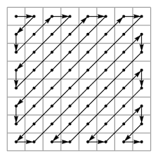

# Lab1 Report

2014011292 李则言

## DCT/IDCT

### 转化为灰度图

将RGB三个分量取平均数就可以

``` python
lena = Image.open("lena.bmp")
gray_scale_lena_arr = np.mean(image2arr(lena), axis=-1)
arr2image(gray_scale_lena_arr).save(os.path.join(output_path, "gray_scale_lena.bmp"))
```

灰度图：


### PSNR的计算

$$
PSNR=10log_{10}\frac{{MAX}^2}{MSE(a, b)}\\
=20log_{10}{MAX}-10log_{10}MSE(a, b)
$$

``` python
def psnr(arr_a, arr_b, max_possible=255.0):
    return 20 * np.math.log10(max_possible) - 10 * np.log10(np.mean((np.asarray(arr_a, np.float64) - np.asarray(arr_b, np.float64)) ** 2 + (EPS,), axis=(0, 1)))
```


### 1D-DCT（First Row Then Column）

1D-DCT是对一个一维序列做DCT，得到一个一维序列。先行后列的1D-DCT指的是先对图片的每一行做DCT，再对结果的每一列做DCT

1D-DCT的定义为
$$
F(u)=\sqrt{\frac{2}{N}}C_u\sum_{i=0}^{N-1}f(i)cos\frac{(2i+1)u\pi}{2N} \\
\text{where } C_u=\begin{cases}\frac{1}{\sqrt2} & u = 0 \\ 1 & otherwise\end{cases}
$$
那么对于一个M行N列的图片$s_{ij}, i\in[0,M), j \in [0, N)$

对每一行做1D-DCT的结果为$r_{ij}$
$$
r_{ij}=\sqrt{\frac{2}{N}}C_j\sum_{x=0}^{N-1}s_{ix}cos{\frac{(2x+1)j\pi}{2N}}
$$
再对$r_{ij}$每一列做1D-DCT的结果为$t_{ij}$
$$
t_{ij}=\sqrt{\frac{2}{M}}C_i\sum_{y=0}^{M-1}r_{yj}cos{\frac{(2y+1)i\pi}{2M}}\\
=\frac{2}{\sqrt{M\cdot N}}C_iC_j\sum_{x=0}^{M}\sum_{y=0}^{N}s_{xy}cos{\frac{(2x+1)i\pi}{2M}}cos{\frac{(2y+1)j\pi}{2N}}
$$


``` python
def dct1d_codec(arr) -> np.ndarray:
    dct1d_cft = arr.astype(np.float64)
    for axis in range(np.ndim(arr)):
        dct1d_cft = dct(dct1d_cft,  norm="ortho", axis=axis)
    return dct1d_cft.astype(np.int64)
```

将最后的DCT系数保存为整数会减少精度,但是考虑到量化的过程,实际的图片编码过程应该使用整数而不是浮点数来存储这些系数.

得到的DCT系数如下图所示:


越靠近左上角,即低频部分的DCT系数,值就越大.

1D-IDCT可以将DCT系数恢复为原始图片.对整张图片进行1D-IDCT就是先列后行地执行IDCT.

``` python
def idct1d_codec(arr) -> np.ndarray:
    idct1d_cft = arr.astype(np.float64)
    for axis in reversed(range(np.ndim(arr))):
        idct1d_cft = idct(idct1d_cft, norm="ortho", axis=axis)
    return idct1d_cft
```

恢复出的图片:


PSNR为49.9988dB,和原图基本没有差别.

### 2D-DCT on the whole image

2D-DCT的定义:
$$
FDCT=\frac{2}{\sqrt{M\cdot N}}C_{u}C_{v}\sum_{i=0}^{M-1}\sum_{j=0}^{N-1}s_{ij}cos{\frac{(2i+1)u\pi}{2M}}cos{\frac{(2j+1)v\pi}{2N}} \\
\text{where }C_{i}=\begin{cases}\frac{1}{\sqrt2} & i = 0 \\ 1 & otherwise\end{cases}
$$
根据之前对先行后列的1D-DCT的推导,它和先行后列的1D-DCT是相同的.因此可以这样实现2D-DCT:

``` python
def dct2(arr):
    return dct(np.swapaxes(dct(np.swapaxes(arr, -1, -2), norm="ortho"), -1, -2), norm="ortho")
```

同理,2D-IDCT也可以有类似的实现:

``` python
def idct2(arr):
    return idct(np.swapaxes(idct(np.swapaxes(arr, -1, -2), norm="ortho"), -1, -2), norm="ortho")
```

2D-DCT的DCT系数如下图所示:


将其恢复为原始图片的结果为:


PSNR为49.9988dB,正如理论分析的结果,和First Row Then Column 1D-DCT/IDCT的结果是相同的.

### 2D-DCT on 8*8 block

和上一节的内容基本相同,只不过现在我们是对图片上每一个8*8的小块分别当成一张单独的小图片进行DCT和IDCT.

首先需要实现对图片进行快速的分块和拼接的方法:

``` python
def blockwise(matrix, block=(3, 3)):  # 分块
    return sliding_window(matrix, block, block)

def sliding_window(matrix, block, step=(1, 1)):
    shape = (int((matrix.shape[0] - block[0]) / step[0] + 1), int((matrix.shape[1] - block[1]) / step[1] + 1)) + block
    strides = (matrix.strides[0] * step[0], matrix.strides[1] * step[1]) + matrix.strides
    return as_strided(matrix, shape=shape, strides=strides)

def block_join(blocks):  # 拼接
    return np.vstack(map(np.hstack, blocks))
```

然后直接在每一个块应用2D-DCT/IDCT:

``` python
def dct2d_codec(arr: np.ndarray, block_size: tuple) -> np.ndarray:
    blocks = blockwise(arr, block_size)
    dct2d_cft = dct2(blocks.astype(np.float64))
    return block_join(dct2d_cft).astype(np.int64)

def idct2d_codec(arr, block_size) -> np.ndarray:
    blocks = blockwise(arr, block_size)
    idct2d_cft = idct2(blocks.astype(np.float64))
    return block_join(idct2d_cft)
```

*这样将表示图片的2维矩阵按8*8分块转换成4维张量进行DCT比使用for循环对每一个块进行DCT是块很多很多倍的,原因一方面是是python的运行机制,另一方面是numpy中对张量运算的优化*

2D-DCT的DCT系数如下图所示:


将其恢复为原始图片的结果为:


PSNR为50.4958dB,和原图基本完全相同.

### 不同方法时间复杂度的比较和分析

### 定义公式和代码实现的复杂度分析

假设输入图片为正方形,边长为$n$

#### 1D

对一个长度为$n$的序列做1D-DCT,需要计算$n$个点,每个点需要$O(n)$的计算量,那么一共需要$O(n^2)$的计算量

那么做先行后列的1D-DCT就一共需要$O(n\times n^2)=O(n^3)$的计算量

实现的时候调用了scipy.fftpack,它不是按照定义实现的,复杂度会小得多,大致为$O(n^2logn)$

#### 2D on the whole image

2D-DCT的定义式中,计算每一个点需要$O(n^2)$的复杂度,所以整张图需要$O(n^4)$的复杂度.

根据之前的理论分析,2D-DCT可以用先行后列的1D-DCT的过程来实现,复杂度可以降低到$O(n^3)$.

考虑到调用scipy.fftpack,复杂度会进一步降低,大致为$O(n^2logn)$


#### 2D on 8*8 block


定义式中,每一个块需要$O(8^4)$的复杂度,总共有$(\frac{n}{8})^2$个块,因此复杂度为$O(n^2)$

在实现中,使用先行后列的1D-DCT实现2D-DCT,每一个块需要$O(8^3)$的复杂度,总的复杂度还是$O(n^2)$

考虑到调用scipy.fftpack,每一个块的计算仍然只需常数时间,块的数目不变,总的复杂度还是$O(n^2)$

#### 实现结果

| 时间(s) | 1D-DCT(FRTC) | 2D-DCT(whole) | 2D-DCT(8*8) |
| ----- | ------------ | ------------- | ----------- |
| DCT   | 0.013009     | 0.012007      | 0.011508    |
| IDCT  | 0.009006     | 0.013007      | 0.01501     |
| ALL   | 0.022015     | 0.025015      | 0.026518    |

#### 分析

考虑到这里$n=512$,$O(n^2logn)$和$O(n^2)$并不能反映准确的运行时间的大小关系,实际上常数的影响可能会很大.实验结果也表明了这一点,三种方法的运行时间是没有明确的大小关系的.

### 不同方法PSNR的分析和比较

| METHOD   | dct1d    | dct2d    | dct2d_88 |
| -------- | -------- | -------- | -------- |
| PSNR(dB) | 49.99877 | 49.99877 | 50.49580 |

本质上dct1d和dct2d的实现是相同的,因此它们的PSNR必然是相同的.

dct2d_88比前两者PSNR略高,主要原因我认为在于dct2d_88每个DCT所做的加法次数少,因此计算的舍入误差小,结果就更加精确.

我们可以观察一下它们对应的MSE,分别为0.6504341885642003, 0.5800966545416774. 图片个每个像素取值是$[0, 255)$,这么小的差异用舍入误差完全可以解释.

### 使用一部分DCT系数

#### 原理和实现

对于三种方法,分别使用$\frac{1}{1}, \frac{1}{4}, \frac{1}{16}, \frac{1}{64}$的DCT系数进行IDCT来恢复原始图像.这样做的好处是可以大大压缩图片的占用空间.

这样做的理论依据在之前展示的DCT系数的计算结果中可以看出来,DCT系数的值绝大多数都集中在左上角的低频部分,高频部分基本都在0左右.所以我们可以只取左上角的DCT系数.

具体地将,我们可以用zig-zag顺序选取左上角的DCT系数:



``` python
def zig_zag_selector(length, rows, columns):
    assert rows > 0 and columns > 0 and length > 0
    if length >= rows * columns:
        return np.ones(shape=(rows, columns), dtype=int)
    ret = np.zeros(shape=(rows, columns), dtype=int)
    last = np.asarray((0, 0))
    cnt = 0
    adder_tuple = [(-1, 1), (1, -1)]
    adder = adder_tuple[1]
    line_cnt = 0
    length = min(length, rows * columns)
    line_start = False
    while True:
        ret[last[0], last[1]] = 1
        cnt += 1
        if cnt >= length:
            break
        if not line_start and (last[0] == 0 or last[1] == 0 or last[1] == columns - 1 or last[0] == rows - 1):
            if line_cnt % 2 == 0:
                last = last + (1, 0) if last[1] == columns - 1 else last + (0, 1)
            else:
                last = last + (0, 1) if last[0] == rows - 1 else last + (1, 0)

            line_start = True
            line_cnt += 1
            adder = adder_tuple[line_cnt % 2]
        else:
            line_start = False
            last += adder
    return ret
```

上面的函数生成一个binary矩阵,左上角以zig-zag顺序填充1,剩下的是0.只需要将这个矩阵和DCT稀疏矩阵相乘就相当于以zig-zag顺序选取了系数.这样做并没有节省存储空间,但是这样做已经足以说明选取部分DCT系数后恢复出的图片质量,而且实现很简便.

对于2D DCT on 8\*8 block,要在每一个8\*8的块上,而不是全图,来选取DCT系数.

#### 结果与分析

将结果整理如下

| PSNR | dct1d                                    | dct2d                                    | dct2d_88                                 |
| ---- | ---------------------------------------- | ---------------------------------------- | ---------------------------------------- |
| 1    | 49.99877dB | 49.99877dB | 50.4958dB |
| 4    | 36.09279dB | 36.09279dB | 34.74324dB |
| 16   | 29.87871dB | 29.87871dB | 27.85957dB |
| 64   | 26.29755dB | 26.29755dB | 24.25341dB |

- 选取的DCT系数越少,图片质量就越低.因为选取的DCT系数越少,高频部分就损失的越严重.

- 如果只选取低频部分,2D-DCT on 8\*8 block的结果比1D-DCT和2D-DCT on the whole image都要差.这是因为如果只保留块内的低频部分,就会使得整张图片颜色的变化不再平滑.在右下角的图片中我们可以很明显地观察到这种现象,每个块内只有一种颜色,块间有明显的颜色跳变.

- PSNR值的大小并不能准确地反映人对图片清晰度的感知.第二行,只选取$\frac{1}{4}$的DCT系数,结果差大约2dB,但是感觉图片质量差不太多.最后一行,同样是差2dB,图片质量差距就非常明显.

  还有更极端的例子,比如下面的图片,和lena.bmp的PSNR有63dB之高,但是内容却只是均一的颜色而已

  

### 代码运行说明

``` bash
python3 image_codec.py
```

- 运行环境:python3.6, 需要numpy, scipy, pillow.
- 大约需要2-3s的运行时间

## Quantization

### 量化的原理

首先我们按照前一个实验的过程,进行2D-DCT on 8\*8 blocks, 得到DCT系数矩阵.

对于DCT系数矩阵中的每一个8\*8的块,使用量化矩阵Q去逐元素地除,注意是整数除法.然后再用Q去和结果矩阵逐元素相乘.量化的一个重要作用就是限制了颜色的数目，因为硬件设备能够处理的颜色是有限的。而且我们人眼能够识别的颜色数目也是有限的，所以量化对图片质量的影响是比较小的。

### 量化矩阵设计

- 因为人眼对图片最直观的感受来自低频部分，高频部分则主要影响图片的细节。而在DCT系数矩阵中，左上角对应低频部分，右上角对应高频部分。所以基本的思路是矩阵中元素的值从左上角往右下角线性递增,这样可以保留低频部分,去除高频部分.线性递增的初始值和增长率经过几次试验确定.

- 量化矩阵中的元素取值越小，PSNR就会越高，但是这种做法就偏离了量化的本意。

- 然后参考给出的几个量化矩阵的设计,右下角高频的部分Q矩阵的值不再增加,也就是锁对于最高频的部分适当保留
  $$
  \text{MY_Q}=\begin{bmatrix}
  1& 1& 1& 2& 2& 3& 4& 4\\
  1& 1& 2& 2& 3& 4& 4& 5\\
  1& 2& 2& 3& 4& 4& 5& 5\\
  2& 2& 3& 4& 4& 5& 5& 6\\
  2& 3& 4& 4& 5& 5& 6& 7\\
  3& 4& 4& 5& 5& 6& 7& 8\\
  4& 4& 5& 5& 6& 7& 8& 7\\
  4& 5& 5& 6& 7& 8& 7& 7\\
  \end{bmatrix}
  $$


### 实验结果与分析

#### 每一块的PSNR

每一个块的PSNR输出到了*lab1_output/quantization/lena_bmp*和*lab1_output/quantization/shana_bmp*中

#### 原图和测试图使用不同量化矩阵的PSNR

| JPEG                                     | NIKON                                    | CANON                                    | MY                                       |
| ---------------------------------------- | ---------------------------------------- | ---------------------------------------- | ---------------------------------------- |
| 33.983982dB | 44.958334dB | 45.153871dB | 47.276401dB |

| JPEG                                     | NIKON                                    | CANON                                    | MY                                       |
| ---------------------------------------- | ---------------------------------------- | ---------------------------------------- | ---------------------------------------- |
| 26.146755dB | 31.262468dB | 30.821854dB | 34.185109dB |

#### 原图和测试图的$\alpha-PSNR$曲线

原图:


测试图:


#### 分析

- 对于JPEG使用的Q量化矩阵而言,随着$\alpha$的增大PSNR基本上是在减小,因为保留的信息越来越少。理论上讲，量化后的元素为$\alpha Q_{ij} \times ceil(\frac{a_{ij}}{\alpha Q_{ij}})$，$\alpha$越大，量化后元素可能的取值就越少，有很多颜色的信息就失去了。

  另外三个总体上来说也是在减小，但是在$\alpha=1$附近有不变甚至增加一小段。

- NIKON和CANON都比JPEG的结果要好得多，这两者之间则不相上下。

- 使用测试图片（绘画，非真实场景）和给出的原图（真实照片）进行测试，结论是一致的。

- 自行设计的矩阵在PSNR上和CANON，NIKON，JPEG相比均更好。缺点就是MY_Q中元素的取值比另外三个矩阵都要小，可能的颜色数量要多，对硬件设备的要求会更高。

### 代码运行说明

```bash
python3 quantization.py
```

- 运行环境:python3.6, 需要numpy, scipy, pillow, matplotlib.
- 需要不超过10min的运行时间

## Motion Estimation and Compensation

## 实验原理

motion estimation指的是从视频中分析运动.block matching指的是通过将参考块和后续帧中的块进行比较,寻找误差最小的块作为移动到的位置的方法.

pixel domain就是直接将参考块和后续帧的每一块计算MSE,寻找MSE最小的块.

compression domain(frequency domain)就是将参考块做DCT,将DCT系数和后续帧的每一块的DCT系数做对比.

## 实验结果

实验中使用的全图块匹配.选取的参考块是第一帧左上角的一个区域，坐标为(48,108):


我在视频的1-45帧中分析参考快的运动，45帧之后画面中就没有这辆车了。

我将Motion Vector和计算出的参考块移动到的位置绘制为一系列图片和视频，在提交文件中的*lab1_output/motion_estimation/*中。为了便于观看,视频的帧率比较小.之后在报告中将只展示图片.图片中绿色方框表示算法得出的参考块移动到的位置,红色箭头表示他从初始位置到当前位置的移动,黑色箭头表示从上一帧到当前帧的移动(一般都很小,不容易看清).

实验中计算MSE的时候图片中颜色的取值范围是$[0,1)$而不是$[0, 255)$,因此MSE比之前exp1,exp2中出现的MSE都要小得多,它们之前是不能直接比较的.

eg.:


### pixel domain

#### all


| frame | 10                                       | 20                                       | 30                                       | 40                                       |
| ----- | ---------------------------------------- | ---------------------------------------- | ---------------------------------------- | ---------------------------------------- |
| image |  |  |  |  |

#### 1/4


| frame | 10                                       | 20                                       | 30                                       | 40                                       |
| ----- | ---------------------------------------- | ---------------------------------------- | ---------------------------------------- | ---------------------------------------- |
| image |  |  |  |  |


#### 1/16


| frame | 10                                       | 20                                       | 30                                       | 40                                       |
| ----- | ---------------------------------------- | ---------------------------------------- | ---------------------------------------- | ---------------------------------------- |
| image |  |  |  |  |

#### 1/64


| frame | 10                                       | 20                                       | 30                                       | 40                                       |
| ----- | ---------------------------------------- | ---------------------------------------- | ---------------------------------------- | ---------------------------------------- |
| image |  |  |  |  |

### frequency domain

#### all


| frame | 10                                       | 20                                       | 30                                       | 40                                       |
| ----- | ---------------------------------------- | ---------------------------------------- | ---------------------------------------- | ---------------------------------------- |
| image |  |  |  |  |

#### 1/4


| frame | 10                                       | 20                                       | 30                                       | 40                                       |
| ----- | ---------------------------------------- | ---------------------------------------- | ---------------------------------------- | ---------------------------------------- |
| image |  |  |  |  |

#### 1/16


| frame | 10                                       | 20                                       | 30                                       | 40                                       |
| ----- | ---------------------------------------- | ---------------------------------------- | ---------------------------------------- | ---------------------------------------- |
| image |  |  |  |  |

#### 1/64


| frame | 10                                       | 20                                       | 30                                       | 40                                       |
| ----- | ---------------------------------------- | ---------------------------------------- | ---------------------------------------- | ---------------------------------------- |
| image |  |  |  |  |

## 分析

### 使用一部分DCT系数

正如之前exp1的分析,图片内容的主要部分是低频部分,也就是DCT系数矩阵的左上角的部分,因此选取一部分DCT系数的时候还是使用zig-zag顺序.

我们看一下使用不同DCT系数的视频的效果对比:

|      | average MSE     | 10                                       | 20                                       | 30                                       | 40                                       |
| ---- | --------------- | ---------------------------------------- | ---------------------------------------- | ---------------------------------------- | ---------------------------------------- |
| all  | 0.0077588178336 |  |  |  |  |
| 1/4  | 0.0077682039137 |  |  |  |  |
| 1/16 | 0.0093794298311 |  |  |  |  |
| 1/64 | 0.0161975308642 |  |  |  |  |

随着使用越来越少的DCT系数,MSE在渐渐增大,但是增加的非常缓慢,即使只是用1/64的DCT系数最后的MSE也仍然很小(对应的PSNR为17dB).

从我们的目标-运动估计的角度来看,使用1/64的DCT系数的结果是非常准确的,从上面的表格以及视频中都可以看出来,绿色方框非常准确地追踪了这辆车的移动.

我们可以看一下参考块的R分量的DCT系数矩阵(G,B也是类似的):


因为左上角的一个值远远大于剩下的所有值,所以选取1/64的值是足够表达这个矩阵的主要特征的.

### 使用一部分raw pixels

一般来说,一个图片的主要部分应该是在图片的中间.因此如果要选取一部分像素点,选取最中央的像素点应该是合理的选择.不过和上面选取DCT系数的理由相比,中间的图片内容更加重要是没有那么确定的,我们可以举出有很多例子,图片的重点信息都不在正中央.

在这个实验中,参考块是人为选取的,我们可以人为地让车的主体尽量集中在参考块的正中央.

|      | average MSE     | 10                                       | 20                                       | 30                                       | 40                                       |
| ---- | --------------- | ---------------------------------------- | ---------------------------------------- | ---------------------------------------- | ---------------------------------------- |
| all  | 0.0077588178336 |  |  |  |  |
| 1/4  | 0.0155073435965 |  |  |  |  |
| 1/16 | 0.0155819810223 |  |  |  |  |
| 1/64 | 0.0524240049233 |  |  |  |  |

随着使用越来越少的像素点,MSE在不断增大.1/64的MSE就比较大了.

实际上在视频中也可以看出来,使用1/64的像素点的时候已经基本不能正确地进行运动估计了.因为这个时候实际上只是用参考块最中央的4个像素在做block matching,整张图片中很可能出现和这4个点非常相似的区域.这4的像素点远远没有左上角的4个DCT系数那样反映整个参考块性质的能力.

### pixel和frequency domain的比较

| AVERAGE MSE | pixel           | compression     |
| ----------- | --------------- | --------------- |
| all         | 0.0077588178336 | 0.0077588178336 |
| 1/4         | 0.0155073435965 | 0.0077682039137 |
| 1/16        | 0.0155819810223 | 0.0093794298311 |
| 1/64        | 0.0524240049233 | 0.0161975308642 |

从理论上讲,使用全部像素点的pixel domain的方式得到的MSE一定是最小的,因为它本身就是在后继帧中寻找MSE最小的块.然而在这种情况下,compression domain的方法得到的MSE完全不比pixel domain差.当我们使用更少的点进行匹配的时候,我们就发现compression domain的效果远远胜过pixel domain.

如果我们有能力使用全部的点进行block matching,在pixel domain是更好的.因为compression domain的效果不会更好,反而会因为DCT操作而消耗更多的时间.

但是当我们要选取少于参考块的像素点个数的特征进行block matching的时候,在compression domain应该是更好的选择.

### 改进的思路

#### 中间区域有更大的权重(center_weight)

在pixel domain,让每个块的中间区域在计算MSE的时候有更大的权重,因为中间区域的内容一般更重要.与只取中间部分的像素点相比,这样可以兼顾块四周的内容.

下面的实现中,在使用1/4的像素点的基础上,对中间1/16像素点增加权重.

| 权重   | average MSE     | 10                                       | 20                                       | 30                                       | 40                                       |
| ---- | --------------- | ---------------------------------------- | ---------------------------------------- | ---------------------------------------- | ---------------------------------------- |
| 2    | 0.0153081818603 |  |  |  |  |
| 4    | 0.0120025337477 |  |  |  |  |
| 8    | 0.0122537392136 |  |  |  |  |


| METHOD          | AVERAGE MSE     |
| --------------- | --------------- |
| center_weight 2 | 0.0153081818603 |
| center_weight 2 | 0.0120025337477 |
| center_weight 2 | 0.0122537392136 |
| only 1/4        | 0.0155073435965 |
| only 1/16       | 0.0155819810223 |

可以看出,相比只使用1/4或者1/16的像素点的结果,使用1/4的像素点,同时将中央1/16的像素点赋予更高的权重,得到的结果是更好的. 

这种方式使用了更少的像素点进行计算,而且还一方面兼顾了四周的像素点,另一方面有突出了中心区域的重要性,因此取得了更好的效果.

#### 阈值计数(count)

我们考虑这样一种情况:一辆车从绿色的草地旁边行驶到灰色的路面上,而车的大小小于参考块,那么这个时候我们对车进行运动估计,参考块和后继帧中车所属的块的MSE就会比较大.但是这主要是由于背景导致的,主要内容都是车,是相同的.

所以在进行块匹配的时候,也许可以不使用MSE最小作为标准,而使用误差小于某个阈值的像素点数目作为标准.这样相当于只考虑两个块之间接近部分的面积,而不去考虑不相似的部分.

| 阈值   | average MSE      | 10                                       | 20                                       | 30                                       | 40                                       |
| ---- | ---------------- | ---------------------------------------- | ---------------------------------------- | ---------------------------------------- | ---------------------------------------- |
| 1e-1 | 0.00860989630057 |  |  |  |  |
| 1e-2 | 0.0144775972026  |  |  |  |  |


可以看出,如果阈值合适的话,这种方式的MSE也是很小的.当然肯定比不上使用全部点的time domain和compression domain的block matching,但是相比它们,这种方法的计算量小得多.

但是如果阈值不合适,比如上面阈值为1e-2的情况,虽然总的MSE看起来还不是很大(没有使用1/64的DCT系数的结果大),但是实际上内容中有好几帧都没有正确地追踪到车的位置.

### 算法的缺点

全图的块匹配,不论是pixel domain还是frequency domain,速度都非常慢,远远赶不上实际视频的帧速度.因此需要启发式的搜索方式来减少计算量,或者使用其他算法(比如optical flow)进行运动估计.

## 运行说明

``` python
python3 motion_estimation.py
```

- 运行环境: python3.6, 需要numpy,av,scipy,matplotlib
- 大约20分钟之内可以运行完,会生成全部的8+5个视频和(8+5)*(45+1)张图片

