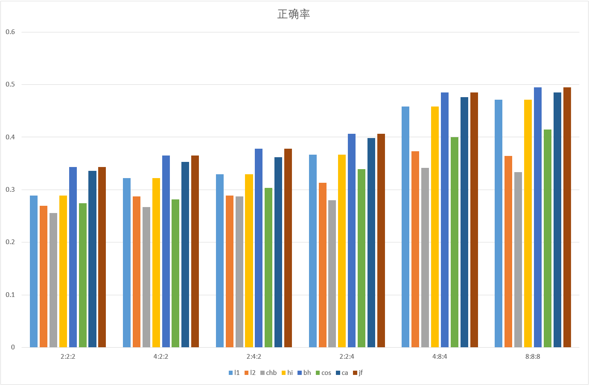
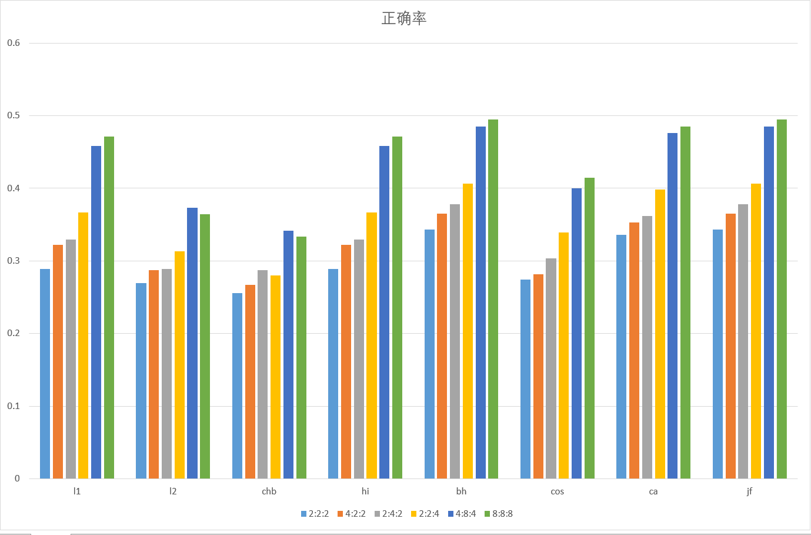

# Lab2 Report

2014011292 李则言

---

## 实验任务

根据内容检索图片。Content Based Image Retrival

- 给定数据集和测试图片，提取每一张图片的颜色分布直方图
- 计算在测试集中和测试图片颜色分布最相近的若干张图片

## 实验原理

### 颜色直方图

实验的核心步骤之一是将一张RGB图片转换为一个颜色直方图向量。

假设我们按$R:G:B=r:g:b$来提取颜色，那么我们需要将$[0,255)$划分成$r$(或$g,b$)个均匀的区间。对于图片上的每一个像素点，分别计算它的RGB分量落在哪一个区间里面，得到一个3维的颜色分布向量。利于如果采用$2:4:2$的划分，颜色$(0, 30, 0)$就落在$(1, 1, 1)$，颜色$(130, 255, 0)$就落在$(2, 4, 1)$

然后我们统计整张图片所有像素点的颜色分布向量。因为颜色分布向量只有$r*g*b$中取值，所以我们可以用一个这么多维的向量表示这张图片的颜色分布直方图，其中每一维就表示对应颜色分布的像素点的数目。为了便于比较不同尺寸的图片，这个向量需要做归一化，使得它的1范数等于1.

### 距离算法

距离算法用来比较两个向量的距离。它的输入是两个向量，输出是一个非负实数表示距离，即$d=f(\vec{a}, \vec{b})$。距离越接近0，表示两个向量越接近。距离等于0当且仅当两个向量相等。

除了要求中的几个距离算法，我还实现了更多的距离算法以作分析，下面具体解释：

#### Mahattan距离(l1)

$$
l1=\sum_{i=1}^N{|\vec{a}_i-\vec{b}_i|}
$$

它的含义正如它的名字，表示在像曼哈顿那样纵横交错的空间中从一点到另一点的最短路程。

#### Euclidean距离(l2)

$$
l2=\sqrt{\sum_{i=1}^N(\vec{a}_i-\vec{b}_i)^2{}}
$$

平面两点连线的长度。

#### 切比雪夫距离(chebyshev, chb)

$$
chb=max\{{|\vec{a}_i-\vec{b}_i|}\}
$$

如果在一个平面网格上，你每次可以移动到周围的任意8个点，那么从一个点到另一个点的最短路程就是切比雪夫距离。

#### 直方图交集(histogram intersection, hi)

$$
hi=1-\sum_{i=1}^{N}min\{\vec{a}_i, \vec{b}_i\}
$$

上式要求$\vec{a},\vec{b}$的1范数都是1.

hi的含义是，如果有两个直方图分布，那么我们求出他们的交集，交集越大则原来的直方图（向量）越相似。

#### bhattacharyya距离(bh)

$$
bh=\sqrt{1-\sum_{i=1}^N{\sqrt{{\vec{a}_i}{\vec{b}_i}}}}
$$

上式要求$\vec{a},\vec{b}$的1范数都是1.

#### 余弦距离(cos)

$$
cos=1-\frac{\vec{a}\cdot\vec{b}}{||\vec{a}||_2||\vec{b}||_2}
$$

余弦距离是1减去两个向量夹角余弦，用1减是为了确保距离越小，向量越接近的性质。在这里$\vec{a}, \vec{b}$的每一个分量都是非负的，所以$\vec{a}\cdot\vec{b}$也是非负的，因此能保证$cos$是非负的。

#### Chi-Square距离(ca)

$$
ca=\sum_{i=1}^{N}\frac{(\vec{a}_i-\vec{b}_i)^2}{\vec{a}_i+\vec{b}_i}
$$

相当于在欧氏距离的每一项上附加了一个权重，如果某一维上两个向量的值特别小，那么这一维上的差别在距离中所占的比例就越高。

#### jffreys距离(jf)

$$
jf=\sqrt{\sum_{i=1}^N{(\sqrt{\vec{a}_i}-\sqrt{\vec{b}_i})^2}}
$$

## 实验结果分析

平均准确率：

| 距离   | 2:2:2    | 4:2:2    | 2:4:2    | 2:2:4    | 4:8:4    | 8:8:8    |
| ---- | -------- | -------- | -------- | -------- | -------- | -------- |
| l1   | 0.288889 | 0.322222 | 0.32963  | 0.366667 | 0.458025 | 0.471605 |
| l2   | 0.269136 | 0.287654 | 0.288889 | 0.31358  | 0.37284  | 0.364198 |
| chb  | 0.255556 | 0.266667 | 0.287654 | 0.280247 | 0.341975 | 0.333333 |
| hi   | 0.288889 | 0.322222 | 0.32963  | 0.366667 | 0.458025 | 0.471605 |
| bh   | 0.34321  | 0.365432 | 0.377778 | 0.406173 | 0.485185 | 0.495062 |
| cos  | 0.274074 | 0.281481 | 0.303704 | 0.339506 | 0.4      | 0.414815 |
| ca   | 0.335802 | 0.353086 | 0.361728 | 0.398765 | 0.476543 | 0.485185 |
| jf   | 0.34321  | 0.365432 | 0.377778 | 0.406173 | 0.485185 | 0.495062 |

正确率最高的也只有大约0.5，所以仅仅通过颜色直方图的方式进行图片检索是十分不精确的方法。





### 不同距离算法的比较

- 可以很明显地看出，无论什么时候，bh的表现都是最好的，jf的表现和bh不相上下。ca比他们的结果稍差一些。chb的结果是最差的。

  大致的排序为bh>jf>ca>hi=l1>cos>l2>chb

- 在bins特别小的时候，各种距离算法之间没有明显的差别，都特别差。表现好的距离算法比如bh，随着bins的增大，正确率也在增大。差的距离算法，比如chb，bins增加，正确率反而会减小。这应该说明它们并不能很好地把握颜色直方图向量的本质.

- HI，l1，l2,chb算法的一个缺点是很容易受到大块的相似的背景颜色的干扰
- 
  比如说有如下三个向量:

  $$
  \vec{a}=(0.3, 0.3, 0.3, 0.1, 0.0) \\\vec{b}=(0.3, 0.3, 0.3, 0.0, 0.1) \\ \vec{c}=(0.2, 0.3, 0.3, 0.2, 0.0)
  $$

  直观上看$\vec{a}, \vec{b}$差距比$\vec{a}, \vec{b}$要大，但是l1, l2, hi,chb给出的结果都是距离相同,相比之下bh,ca,jf都给出了正确的判断.


### 不同bins的比较

很明显的是随着bins的增加,正确率基本上是越来越高的.但是bins并不是越大越好,比如我们可以尝试一次$32:32:32$的划分:

``` bash
$ python3 image_retrieval.py -q QueryImages.txt --base_dir DataSet --data AllImages.txt --bins 32 32 32 -f bh
[2017-05-28 18:41:54] setting up ImageRetriever
[2017-05-28 18:59:08] finish setting up ImageRetriever
[2017-05-28 18:59:08] attributes: 32_32_32_bhattacharyya
[2017-05-28 19:00:58] total precision: 0.24691358024691357
```

可以看出,特别大的bins划分会导致正确率下降.因为太过精细的划分会让显示的颜色划分到不同的区间去.而对于颜色直方图方法,只要是不同的区间,不论是否相似,都是等同看待的.而且这么大的划分还会导致运行时间急剧增加.

总而言之,bins既不能过大, 也不能过小,最合适的取值和具体的距离算法有关.再考虑到运行时间,128bins就是比较合适的划分了.

## 算法改进

### 思路

颜色直方图的一个很大的缺点是只考虑的图片中总的颜色分布,而不能意识到颜色的空间分布.考虑到一个图片的主要内容往往在图片的正中央,因此一个简单的思路是让图片的中间的块在整个颜色直方图中占有更大的权重.

### 实现

设定参数`center_weight`,在每个颜色直方图向量中将每张图片中间$\frac{2}{3}$的内容乘上该权重.

### 结果

#### `center_wetght=4`

| 距离   | 2:2:2    | 4:2:2    | 2:4:2    | 2:2:4    | 4:8:4    | 8:8:8    |
| ---- | -------- | -------- | -------- | -------- | -------- | -------- |
| l1   | 0.293827 | 0.34321  | 0.345679 | 0.380247 | 0.450617 | 0.47284  |
| l2   | 0.290123 | 0.309877 | 0.308642 | 0.34321  | 0.393827 | 0.369136 |
| chb  | 0.280247 | 0.301235 | 0.291358 | 0.318519 | 0.341975 | 0.302469 |
| hi   | 0.293827 | 0.34321  | 0.345679 | 0.380247 | 0.450617 | 0.47284  |
| bh   | 0.359259 | 0.385185 | 0.396296 | 0.422222 | 0.490123 | 0.498765 |
| cos  | 0.280247 | 0.323457 | 0.330864 | 0.365432 | 0.412346 | 0.41358  |
| ca   | 0.346914 | 0.37037  | 0.383951 | 0.412346 | 0.469136 | 0.490123 |
| jf   | 0.359259 | 0.385185 | 0.396296 | 0.422222 | 0.490123 | 0.498765 |
|      |          |          |          |          |          |          |

#### `center_weight=16`

| 距离   | 2:2:2    | 4:2:2    | 2:4:2    | 2:2:4    | 4:8:4    | 8:8:8    |
| ---- | -------- | -------- | -------- | -------- | -------- | -------- |
| l1   | 0.283951 | 0.335802 | 0.338272 | 0.382716 | 0.444444 | 0.464198 |
| l2   | 0.27037  | 0.304938 | 0.31358  | 0.344444 | 0.383951 | 0.369136 |
| chb  | 0.260494 | 0.312346 | 0.3      | 0.325926 | 0.348148 | 0.303704 |
| hi   | 0.283951 | 0.335802 | 0.338272 | 0.382716 | 0.444444 | 0.464198 |
| bh   | 0.35679  | 0.380247 | 0.4      | 0.425926 | 0.471605 | 0.482716 |
| cos  | 0.287654 | 0.314815 | 0.333333 | 0.360494 | 0.398765 | 0.412346 |
| ca   | 0.340741 | 0.37037  | 0.379012 | 0.418519 | 0.459259 | 0.479012 |
| jf   | 0.35679  | 0.380247 | 0.4      | 0.425926 | 0.471605 | 0.482716 |
|      |          |          |          |          |          |          |

#### `center_weight=256`

| 距离   | 2:2:2    | 4:2:2    | 2:4:2    | 2:2:4    | 4:8:4    | 8:8:8    |
| ---- | -------- | -------- | -------- | -------- | -------- | -------- |
| l1   | 0.290123 | 0.32716  | 0.344444 | 0.388889 | 0.42963  | 0.45679  |
| l2   | 0.269136 | 0.302469 | 0.314815 | 0.346914 | 0.381481 | 0.362963 |
| chb  | 0.258025 | 0.304938 | 0.295062 | 0.325926 | 0.340741 | 0.317284 |
| hi   | 0.290123 | 0.32716  | 0.344444 | 0.388889 | 0.42963  | 0.45679  |
| bh   | 0.361728 | 0.38642  | 0.397531 | 0.424691 | 0.461728 | 0.479012 |
| cos  | 0.282716 | 0.314815 | 0.328395 | 0.362963 | 0.4      | 0.402469 |
| ca   | 0.349383 | 0.366667 | 0.379012 | 0.422222 | 0.441975 | 0.467901 |
| jf   | 0.362963 | 0.38642  | 0.397531 | 0.424691 | 0.461728 | 0.479012 |
|      |          |          |          |          |          |          |

#### `center-weight=0.5`

| 距离   | 2:2:2    | 4:2:2    | 2:4:2    | 2:2:4    | 4:8:4    | 8:8:8    |
| ---- | -------- | -------- | -------- | -------- | -------- | -------- |
| l1   | 0.283951 | 0.297531 | 0.316049 | 0.349383 | 0.438272 | 0.449383 |
| l2   | 0.260494 | 0.264198 | 0.277778 | 0.304938 | 0.364198 | 0.35679  |
| chb  | 0.249383 | 0.254321 | 0.27037  | 0.277778 | 0.323457 | 0.348148 |
| hi   | 0.283951 | 0.297531 | 0.316049 | 0.349383 | 0.438272 | 0.449383 |
| bh   | 0.332099 | 0.333333 | 0.35679  | 0.391358 | 0.475309 | 0.482716 |
| cos  | 0.264198 | 0.262963 | 0.292593 | 0.314815 | 0.392593 | 0.406173 |
| ca   | 0.32963  | 0.330864 | 0.339506 | 0.377778 | 0.464198 | 0.465432 |
| jf   | 0.32963  | 0.333333 | 0.35679  | 0.391358 | 0.475309 | 0.482716 |
|      |          |          |          |          |          |          |


### 分析

- 很明显,适当地提高中心区域的权重可以非常有效地提高正确率.原理正如之前所说,一个图片的核心往往就是在中间的区域,四周一般是背景.
- 如果`center_weight`过大,就相当于只考虑中间区域,那么这个时候正确率就很可能会下降.这也很显然,只考虑中间部分是比不上兼顾增长图片的.

## 运行说明

- 运行要求：python3.6，必要的python库（numpy，pillow，scipy）

- 源代码文件：
  - image_retrival.py。 

    可运行.

    运行时间和bins数目有关.一般128bins的话10s左右可以运行完.

    读取AllImage.txt，根据指定的bins和距离算法建立索引。从QueryImages.txt或者stdin中读取待查询的图片并做查询，输出结果和正确率。

    eg.

    ``` bash
    python3 image_retrival.py -q QueryImages.txt --bins 2 4 2 -f hi -o ./lab2_output -b ./DataSet  # 数据在DataSet目录下。输出结果到lab2_output，默认的索引数据文件为./AllImages.txt。读取QueryImages.txt。采用hi距离算法，2：4：2颜色直方图。
    ```

    ```bash
    python image_retrival.py --help  # 查看帮助
    ```

    ​

  - run_lab2.py    

    可运行.

    4核并行的话一般10分钟之内可以执行完.

    lab2整个的工作流，会组合所有的bins,距离算法,center_weight来运行`image_retrieval.py`，汇总最后的结果输出到csv文件中。

    eg.

    ``` bash
    python run_lab2.py -j 4 # 4进程并发测试。待测试的距离算法和bins设置变化较少，在脚本代码中配置。
    ```

  - utility.py

    不可直接运行。包含了一些通用的函数。独立到一个文件中主要是因为有和lab1公用的函数。